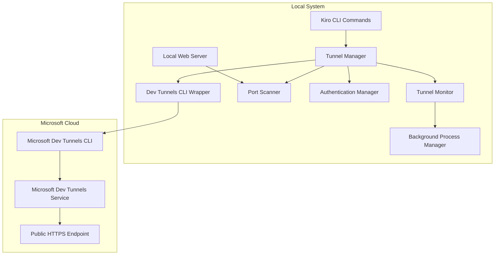

# Dev Tunnels Integration Design Document

## Overview

The Dev Tunnels integration provides a seamless way to expose local development servers to the internet using Microsoft Dev Tunnels. The system consists of a Tunnel Manager service, CLI wrapper, and helper commands that automate the entire process from installation to tunnel management.

The architecture follows a modular approach with clear separation between CLI operations, tunnel management, and user interface components. The system is designed to be resilient with automatic reconnection capabilities and comprehensive error handling.

## Architecture



## Components and Interfaces

### 1. Tunnel Manager (Core Service)

**Purpose**: Central orchestrator for all tunnel operations

**Key Methods**:
- `createTunnel(port?: number): Promise<TunnelInfo>`
- `stopTunnel(tunnelId: string): Promise<void>`
- `getTunnelStatus(): Promise<TunnelStatus[]>`
- `reconnectTunnel(tunnelId: string): Promise<void>`

**Responsibilities**:
- Coordinate between all subsystems
- Manage tunnel lifecycle
- Handle error recovery
- Maintain tunnel state

### 2. CLI Wrapper

**Purpose**: Interface with Microsoft Dev Tunnels CLI

**Key Methods**:
- `isInstalled(): Promise<boolean>`
- `install(): Promise<void>`
- `authenticate(): Promise<AuthStatus>`
- `createTunnel(port: number, options: TunnelOptions): Promise<string>`
- `deleteTunnel(tunnelId: string): Promise<void>`

**Implementation Details**:
- Uses child_process to execute CLI commands
- Parses CLI output for structured data
- Handles CLI installation via npm or direct download
- Manages authentication tokens

### 3. Port Scanner

**Purpose**: Detect active local web servers

**Key Methods**:
- `scanCommonPorts(): Promise<number[]>`
- `isPortActive(port: number): Promise<boolean>`
- `validateHttpService(port: number): Promise<boolean>`

**Scan Strategy**:
- Check ports: 3000, 4000, 5000, 8000, 8080, 9000
- Send HTTP HEAD request to validate service
- Return list of active HTTP/HTTPS services

### 4. Authentication Manager

**Purpose**: Handle Microsoft account authentication

**Key Methods**:
- `isAuthenticated(): Promise<boolean>`
- `authenticate(): Promise<void>`
- `refreshToken(): Promise<void>`
- `getAuthStatus(): Promise<AuthInfo>`

**Security Considerations**:
- Store tokens in secure system keychain
- Implement token refresh logic
- Handle authentication failures gracefully

### 5. Tunnel Monitor

**Purpose**: Monitor tunnel health and handle reconnections

**Key Methods**:
- `startMonitoring(tunnelId: string): void`
- `stopMonitoring(tunnelId: string): void`
- `checkTunnelHealth(tunnelId: string): Promise<boolean>`

**Monitoring Strategy**:
- Periodic health checks every 30 seconds
- Exponential backoff for reconnection (1s, 2s, 4s, 8s, 16s)
- Maximum 5 reconnection attempts
- Event-driven status updates

### 6. Background Process Manager

**Purpose**: Manage long-running tunnel processes

**Key Methods**:
- `startProcess(command: string, args: string[]): Promise<ProcessInfo>`
- `stopProcess(processId: string): Promise<void>`
- `getProcessStatus(processId: string): Promise<ProcessStatus>`

**Process Management**:
- Use Node.js child_process with detached option
- Capture stdout/stderr for logging
- Handle process cleanup on exit
- Store process PIDs for management

## Data Models

### TunnelInfo
```typescript
interface TunnelInfo {
  id: string;
  port: number;
  publicUrl: string;
  status: 'active' | 'inactive' | 'connecting' | 'error';
  createdAt: Date;
  lastHealthCheck?: Date;
}
```

### TunnelOptions
```typescript
interface TunnelOptions {
  name?: string;
  allowAnonymous?: boolean;
  accessControl?: 'public' | 'authenticated';
  protocol?: 'http' | 'https';
}
```

### AuthInfo
```typescript
interface AuthInfo {
  isAuthenticated: boolean;
  accountEmail?: string;
  tokenExpiry?: Date;
  lastAuthCheck: Date;
}
```

### ProcessInfo
```typescript
interface ProcessInfo {
  id: string;
  pid: number;
  command: string;
  status: 'running' | 'stopped' | 'error';
  startTime: Date;
  output: string[];
}
```

## Error Handling

### Installation Errors
- **CLI Not Found**: Attempt automatic installation via npm
- **Installation Failed**: Provide manual installation instructions
- **Permission Denied**: Guide user through admin installation

### Authentication Errors
- **Login Failed**: Redirect to browser authentication flow
- **Token Expired**: Automatic token refresh with fallback to re-auth
- **Account Issues**: Clear error messages with Microsoft support links

### Tunnel Creation Errors
- **Port In Use**: Scan for alternative ports or prompt user
- **Network Issues**: Retry with exponential backoff
- **Quota Exceeded**: Display quota information and upgrade options
- **Invalid Configuration**: Validate inputs and provide corrections

### Runtime Errors
- **Connection Lost**: Automatic reconnection with user notification
- **Local Server Down**: Pause tunnel and monitor for server restart
- **CLI Process Crashed**: Restart CLI process and restore tunnel

## Testing Strategy

### Unit Tests
- Mock CLI wrapper for isolated testing
- Test port scanning logic with mock servers
- Validate authentication flow with mock tokens
- Test error handling scenarios

### Integration Tests
- End-to-end tunnel creation and deletion
- Authentication flow with test Microsoft account
- Port detection with real local servers
- Reconnection logic with simulated network issues

### Manual Testing
- Test with various local development servers (React, Express, etc.)
- Verify cross-platform compatibility (Windows, macOS, Linux)
- Test authentication with different Microsoft account types
- Validate public URL accessibility from external networks

## Implementation Phases

### Phase 1: Core Infrastructure
- CLI wrapper implementation
- Basic tunnel creation and deletion
- Port scanning functionality
- Simple command interface

### Phase 2: Authentication & Monitoring
- Microsoft account authentication
- Tunnel health monitoring
- Automatic reconnection logic
- Enhanced error handling

### Phase 3: User Experience
- Helper commands (kiro tunnel start/stop/status)
- Rich status display and notifications
- Configuration persistence
- Comprehensive logging

### Phase 4: Advanced Features
- Multiple tunnel management
- Custom tunnel naming and configuration
- Integration with existing development workflows
- Performance monitoring and analytics

## Security Considerations

### Authentication Security
- Use Microsoft's official authentication flow
- Store tokens in system keychain (Windows Credential Manager, macOS Keychain)
- Implement secure token refresh mechanism
- Clear tokens on logout or uninstall

### Tunnel Security
- Default to authenticated access for tunnels
- Provide clear warnings for public tunnels
- Implement tunnel access logging
- Support tunnel deletion on security concerns

### Local System Security
- Validate CLI downloads with checksums
- Run CLI processes with minimal privileges
- Sanitize all user inputs to CLI commands
- Implement secure process management

## Performance Considerations

### Resource Usage
- Minimize background monitoring overhead
- Use efficient port scanning techniques
- Implement connection pooling for health checks
- Optimize CLI command execution

### Scalability
- Support multiple concurrent tunnels
- Handle high-traffic scenarios gracefully
- Implement rate limiting for API calls
- Cache authentication tokens appropriately

### Reliability
- Implement circuit breaker pattern for external calls
- Use persistent storage for tunnel configuration
- Handle system sleep/wake cycles
- Provide graceful degradation on failures